# My Keyboard Configuration

This repository hosts my configuration for the [Dygma Defy](https://dygma.com/pages/defy) keyboard. As I adjust to this keyboard, I'll update the layout accordingly. In my layout research, I often found a lack of explanation frustrating, so I will not only share my current setup but aim to provide thorough reasoning here as well.

I believe that personal preferences significantly influence keyboard layout choices, so here's a bit about me:

- I'm a German software developer.
- I regularly use both German and English.
- I have been typing for over 20 years, but only recently started touch typing.
- My touch typing speed on QWERTZ was around 50 wpm, and 80 wpm with occasional glances at the keyboard.
- As a software developer I code in Python, JavaScript, C#, Rust, HTML, CSS and more.
- Gaming is one of my hobbies, but I don't engage in professional gaming.

## Physical keyboard

I upgraded from a [Logitech G915 TKL](<https://amzn.to/479JC5t>) QWERTZ keyboard with brown switches to the [Dygma Defy](https://dygma.com/pages/defy), a split ortholinear keyboard featuring 8 thumb keys on each side. My version is black, has Dash keycaps and Kailth Silent Brown switches.

## Windows Layout

Transitioning from a German QWERTZ layout, I explored various ergonomic layouts: [Dvorak](https://en.wikipedia.org/wiki/Dvorak_keyboard_layout), [Neo2](https://neo-layout.org/) plus its newer variants, [Workman](https://workmanlayout.org/), [EurKEY](https://eurkey.steffen.bruentjen.eu/), [Colemak](https://colemak.com/), [Colemak-DH](https://colemakmods.github.io/mod-dh/), etc.

Eventually, I settled on [Colemak-DH](https://colemakmods.github.io/mod-dh/). It seemed the best fit for ergonomics and supporting both English and German. However, I noticed the symbols and symbol layer weren't as well-considered, often remaining in their QWERTY positions.

I initially considered using the [Colemak-DH](https://colemakmods.github.io/mod-dh/) windows layout or [EurKEY](https://eurkey.steffen.bruentjen.eu/), but I can not install that on all devices I use (client work). The same goes for [DreymaR's Big Bag Of Tricks / EPKL](https://github.com/DreymaR/BigBagKbdTrixPKL).

So I went with [English International QWERTY](https://en.wikipedia.org/wiki/QWERTY#US-International) instead, despite its less convenient dead keys. But I have found workable solutions for that.

## Keyboard Layout

I've configured the [English International QWERTY](https://en.wikipedia.org/wiki/QWERTY#US-International) layout to match Colemak-DH using [Bazecor](https://github.com/Dygmalab/Bazecor). This is the layout I'm using now as my [base layer](#base-layer-1) (with some adjustments).

### Key colors

Using the [Tailwind CSS color palette](https://tailwindcss.com/docs/customizing-colors), I've color-coded the keys for easier learning. The hardware brightness is set to 20% in Bazecor. The color scheme includes:

- Non-functional keys:
  - #000000 (Black)
- Letter keys:
  - #0E7490 (Cyan 700):
- Destructive operations (Esc, Backspace, Delete):
  - #DC2626 (Red 600):
- Number keys (0-9):
  - #FB923C (Orange 400)
- Modifier keys (Shift, Ctrl, Alt, OS):
  - #A21CAF (Fuchsia 700)
- Function keys (F1-F12):
  - #E879F9 (Fuchsia 400)
  - #FB7185 (Rose 400) (alternative)
- Navigation keys (Arrow keys, Mouse, Tab):
  - #FACC15 (Yellow 400)
  - #FB923C (Orange 400) (alternative)
- Special keys (Print, Insert, Num Lock, ...):
  - #6D28D9 (Violet 700)
- Multimedia keys
  - #E879F9 (Fuchsia 400)
- Layer shift:
  - #15803D (Green 700)
- Symbols:
  - #94A3B8 (Slate 400)
- Space, Enter, Homing keys:
  - #F8FAFC (Slate 50)

I've employed secondary colors for accentuation and clarity, like yellow and orange for navigation keys. Also the keys for e.g. switching to the symbol layer are in the same colour as the symbols themselves and not in the "layer" colour.

### Layers

I use several layers for different purposes:

- [Base Layer](#base-layer-1): Main typing layout ([Colemak-DH](https://colemakmods.github.io/mod-dh/)) with specific modifications for comfort and efficiency.
- [Navigation](#navigation-layer-2): Optimized for cursor and mouse control.
- [Symbols](#symbols-layer-3): Inspired by [Getreuer's layout](https://getreuer.info/posts/keyboards/symbol-layer/index.html), with minor tweaks.
- [Gaming](#gaming-layer-4): Mimics QWERTY for gaming compatibility.
- [Shift](#shift-layer-5): Shifted versions of base layer keys.
- [Numpad](#numpad-layer-6): For numerical input, mimicking a traditional numpad layout.
- [German Umlauts](#german-umlauts-layer-7): Easy access to ä, ö, ü, ß using an OSL key.

### Base Layer (1)

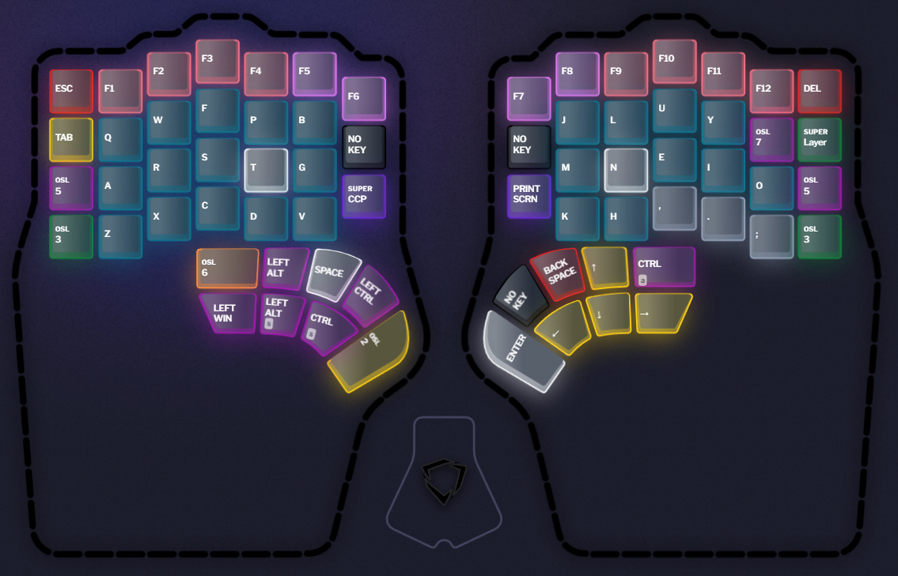

This layer reflects the [Colemak-DH](https://colemakmods.github.io/mod-dh/) layout with modifications:

- \[F1\] - \[F12\] keys replace the number row.
  - The numbers are now on the [symbols layer](#symbols-layer-3) instead.
  - I made this change because I use the \[F*\] keys a lot in my work and I want to be able to reach them without having to use the layer shift.
- Comma \[,\], dot \[.\] and semicolon \[,\] are the only symbols left on the base layer.
  - The other symbols are on the [symbols layer](#symbols-layer-3).
  - Since I have \[<\] and \[>\] in an easily accessible and logical position on the [symbols layer](#symbols-layer-3), I wanted to have another value for the shifted state of \[,\] and \[.\]. Since this is not directly possible, I decided to use a separate [shift layer](#shift-layer-5) instead of the normal shift key.
- I put \[Del\] on the right side, in the mirrored position of the \[Esc\] key.
  - This feels quite natural coming from a QWERTZ keyboard. I had \[Del\] on the right thumb cluster next to \[Backspace\] before, but I found that I too often pressed it by accident.
- The [shift layer](#shift-layer-5) is reachable on both pinkies in the home row. I prefer to have it here instead of one row lower because it is easier to reach and I use it more often than the [symbols layer](#symbols-layer-3).
- The [symbols layer](#symbols-layer-3) has the same position as the shift layer, but one key lower. I have it on both hands as well, because the layer contains a lot of symbols on both hands.
- The German characters \[ä\] \[ö\] \[ü\] \[ß\] are accessible on an [umlaut layer](#german-umlauts-layer-7). This layer is accessible with the right little finger as an [OSL (One-Shot-Layer key)](https://support.dygma.com/hc/en-us/articles/360007166377-What-are-One-Shot-Modifiers-and-One-Shot-Layers-).
- I have a Superkey "CCP" (Copy / Cut / Paste) which does exactly that:
  - Tap: Copy
  - 2x Tap: Cut
  - Hold: Paste
- The \[Print Screen\] key is on the base layer as well, because I use it quite often and like that it is easily accessible.
- I also have a Superkey "Layer" which for now mainly has the functionality to bring me back to the base layer from whereever I are if I accidentally ended up somewhere else. I also activate the [gaming layer](#gaming-layer-4) with it.
  - Tap: [Base layer](#base-layer-1)
  - 2x Tap: [Gaming layer](#gaming-layer-4)

Two spots are still free. I'm not sure what to put there yet and don't want to clutter the layout with something only rarely used.

Thumb keys:

- This has gone through several iterations. I find it very hard to accurately hit the thumb keys, so I have tried not to overload this.
- Left hand
  - I have only ever used the left hand for space and the modifier keys on QWERTZ, so I decided to keep it that way.
  - Space is the most important key, so it got the "home" left thumb key.
  - \[Alt\] and \[Ctrl\] are next to it, so they are easily reachable.
  - Below \[Alt\] and \[Ctrl\] I have the shifted versions of those (\[Alt+Shift\] and \[Ctrl+Shift\]). I find it easier to only have to press one key instead of two for those modifiers and they are used quite often in various applications like editors and IDEs.
  - \[Win\] takes the place that is the hardest to reach because I use it least often.
  - The big thumb button has an [OSL (One-Shot-Layer key)](https://support.dygma.com/hc/en-us/articles/360007166377-What-are-One-Shot-Modifiers-and-One-Shot-Layers-) that activates the [navigation layer](#navigation-layer-2). I had it on another position before, but I find it easier to blindly hit it here to access the navigation layer more quickly.
  - The remaining left thumb key has an [OSL (One-Shot-Layer key)](https://support.dygma.com/hc/en-us/articles/360007166377-What-are-One-Shot-Modifiers-and-One-Shot-Layers-) that activates the [numpad layer](#numpad-layer-6).
- Right hand
  - \[Backspace\] is also often used, so it got the "home" right thumb key.
  - The space left to it is unused for now because I too often press it accidentally.
  - \[Enter\] on the big thumb key.
  - The arrow keys in the usual layout ("WASD" like, not "HJKL"). This is experimental, I might remove them in the future and only rely on the navigation layer. But for now I find it easier to use them here sometimes. Not really decided on this.
  - \[Ctrl+Alt\] on the remaining right thumb key. This is used only rarely (especially with the [symbols layer](#symbols-layer-3) being present), so it's okay that it's a bit harder to reach. I use it mostly for autofill \[Ctrl+Alt+A\] in [KeepassXC](https://keepassxc.org/).

### Shift Layer (5)

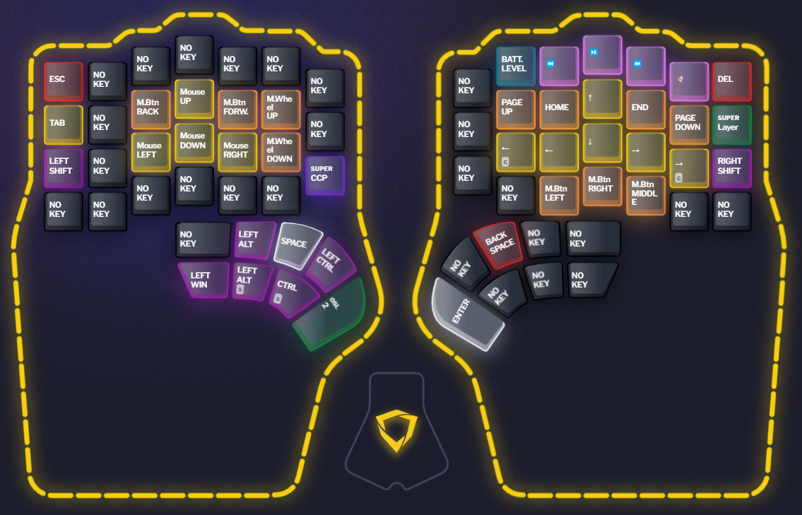

This layer complements the [base layer](#base-layer-1). Most of the keys are the same as they are there, but with an added "shift" modifier. The following keys are different:

- The comma \[,\] has the single quote \['\] as its shifted state. This makes for a very convenient way to type the common English contractions with "n'" like "don't", "can't", "won't" and even better for "I'" like "I'm", "I'll", "I'd" etc. Also \['\] almost looks like \[,\], so it's easier to remember.
- The dot \[.\] has the double quotation mark \["\] as its shifted state. I previously had the single quote here, typing "I'" was too cumbersome.
- The semicolon \[;\] currently has no shifted state because \[:\] is available on the [symbols layer](#symbols-layer-3). I might put something here in the future.
- In the English International keyboard layout, some keys are dead keys. I cannot stand this at all, so whereever I use these keys I actually instead have a macro that types the key followed by a space. I affectionately call these "Undead" keys. I use them for single quotes \['\] and double quotes \["\] here and for the backtick \[`\], tilde \[~\] and circumflex \[^\] on the [symbols layer](#symbols-layer-3).

### German Umlauts Layer (7)

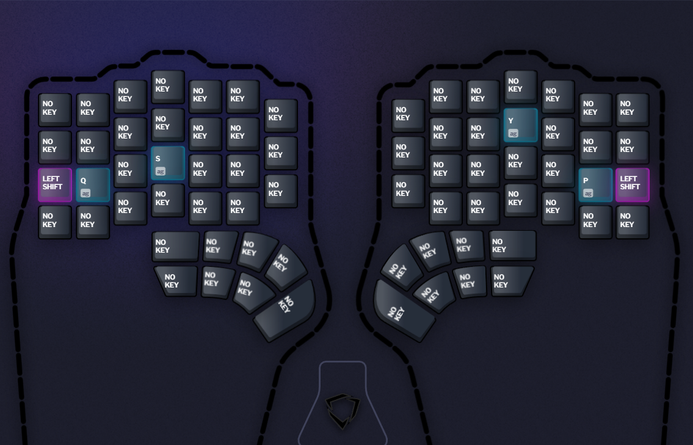

This means that when I press my right pinky, the layer is activated until I press another key. This way I can type the German characters without having to hold down the key. Having them in the same position as the characters without the dots is very intuitive and easy to learn.

### Symbols Layer (3)

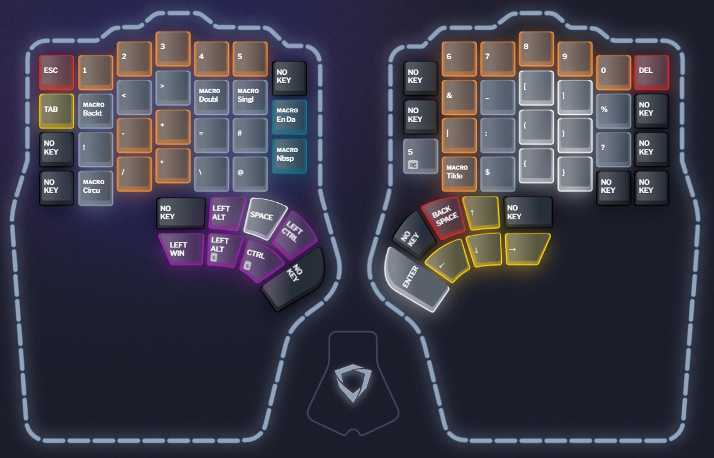

I took heavy inspiration from [Getreuer's layout](https://getreuer.info/posts/keyboards/symbol-layer/index.html) for this layer. It is (imho) the best symbols layer on the internet with a lot of thought put into the placement of the symbols. I only made some very small changes to it, to accomodate the fact that my base layer has other symbols on it then his.

I also added keys for \[En Dash\] (–) for my typographic satisfaction and the \[Nbsp\] (non-breaking space) for my programming needs.

If you want to tweak it to your needs, [Xah Lee's page on char distribution](http://xahlee.info/comp/computer_language_char_distribution.html) is a useful resource for the distribution of symbols in various programming languages.

### Navigation Layer (2)

This layer is used for navigation.

Mouse navigation:

- The mouse movement is controlled with the left hand in a "WASD" like layout.
- The mouse wheel also is on this hand next to the mouse movement keys.
- The "Back" and "Forward" buttons are rarely used together with mouse movement, so they are on the left hand as well.
- The "Left click", "Right click", "Mittle click" mouse buttons are on the right hand to make it easier to move the mouse while also holding down a button.

Cursor navigation:

- The cursor movement is controlled with the right hand in a "WASD" like layout.
- To the left is an added \[Ctrl+Left\] key for jumping to the beginning of a word. To the right is an added \[Ctrl+Right\] key for jumping to the end of a word.
- The "Home", "End", "Page Up" and "Page Down" keys are placed next to the cursor movement keys.

Other keys:

- The right thumb cluster has no navigation keys here as it would be duplicating those.
- On the right hand, I also have the media keys \[(Play/Pause\], \[Next\], \[Previous\]) and the \[Mute\] key and it's kind of "navigating music" (yes, that's a bit of a stretch), so I put them here as well.

### Gaming Layer (4)

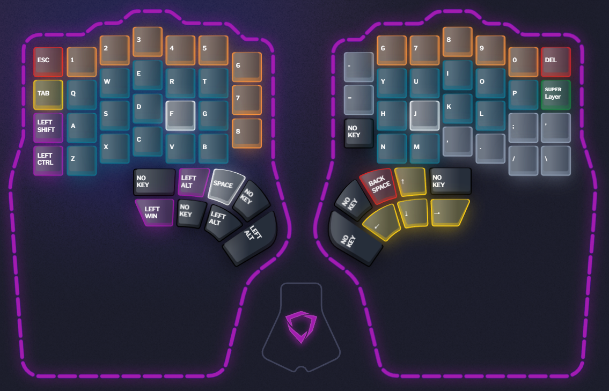

This layer tries to resemble QWERTY as much as possible, so for gaming I don't have to remap the keys in the game.

Notable key placements:

- The number keys on the left hand are extended downwards up to 8, so I can reach mor "hotbar" keys with my left hand.
- \[Shift\], \[Ctrl\] and \[Alt\] are placed so they resemble the positions on a classic keyboard. Games often rely on pressing one of those as a modifier for various actions, so I wanted to have them accessible is the usual positions.

Problems:

The "WASD" feels unnatural because of the ortholinear shifting. I'm thinking about shifting all the keys one column to the right, so these keys are on the "home row" instead. But I'm not sure how to best place \[Shift\] and \[Ctrl\] for that. I think they would need to be shifted one row to the right as well, but then "TGB" would have to be put on the leftmost column. It might work, depending on the game and how the keys are used there.

An alternative would also be to remap games to use "ESDF" instead of "WASD", but I'm not sure if that would be worth the hassle.

I guess I'll have to try these possibilities out for a while and see what works best.

### Numpad Layer (6)

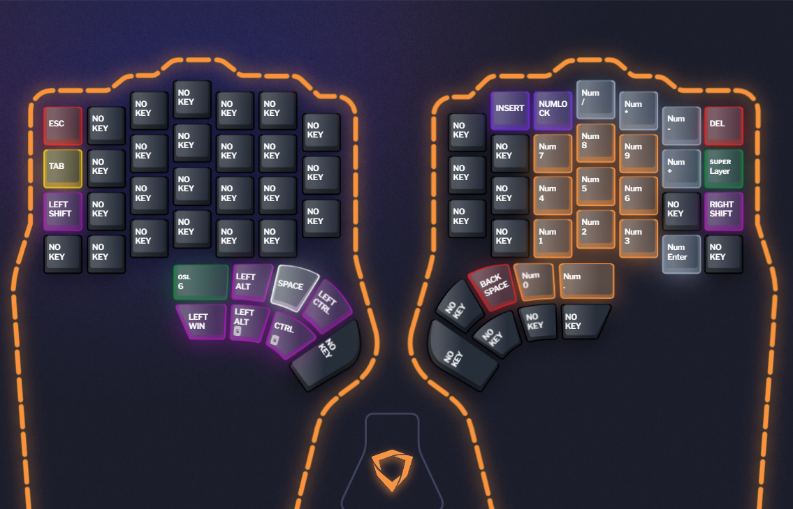

This layer is used for the numpad. I use it mainly for entering numbers, but also has the usual \[+\] \[-\] \[*\] \[/\] and \[Num Enter\] key. The \[0\] and \[.\] keys are on thumb cluster, quite conveniently placed almost as they would be on a normal numpad.

The \[Numlock\] and \[Insert\] keys are also on this layer, but I rarely use them.

I placed the numpad on the right hand because I'm used to it and can easily type numbers from muscle memory. The left hand is basically unused for now.

### Macro Keys

Here are the macros I use:

Backtick (Undead):
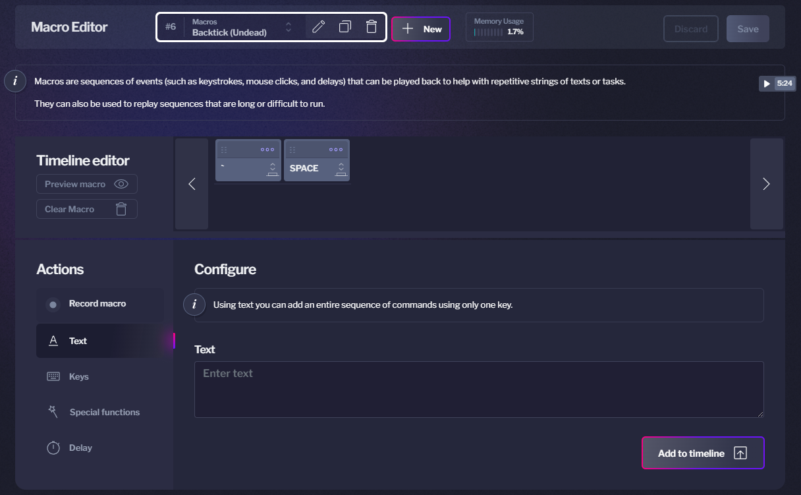

Tilde (Undead):
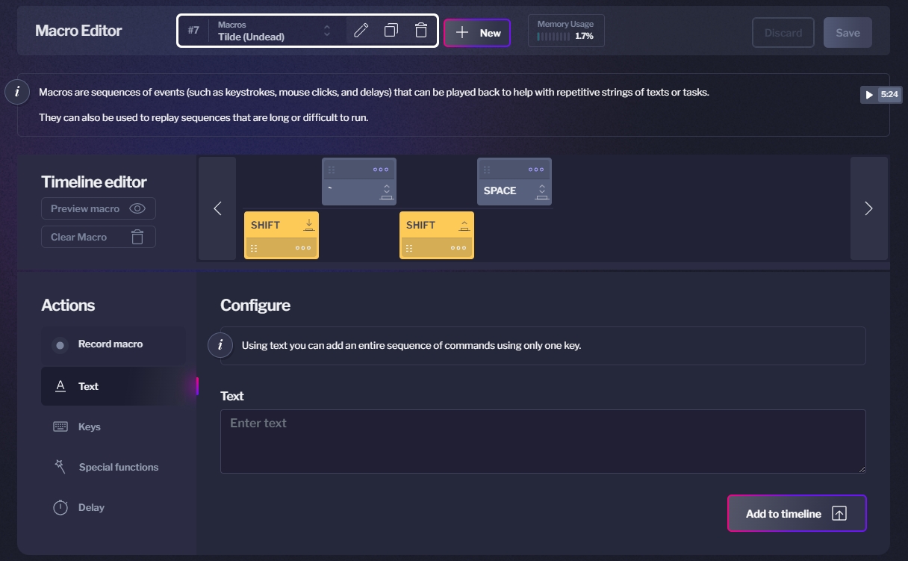

Circumflex (Undead):

Single Quote (Undead):

Double Quote (Undead):

En Dash:
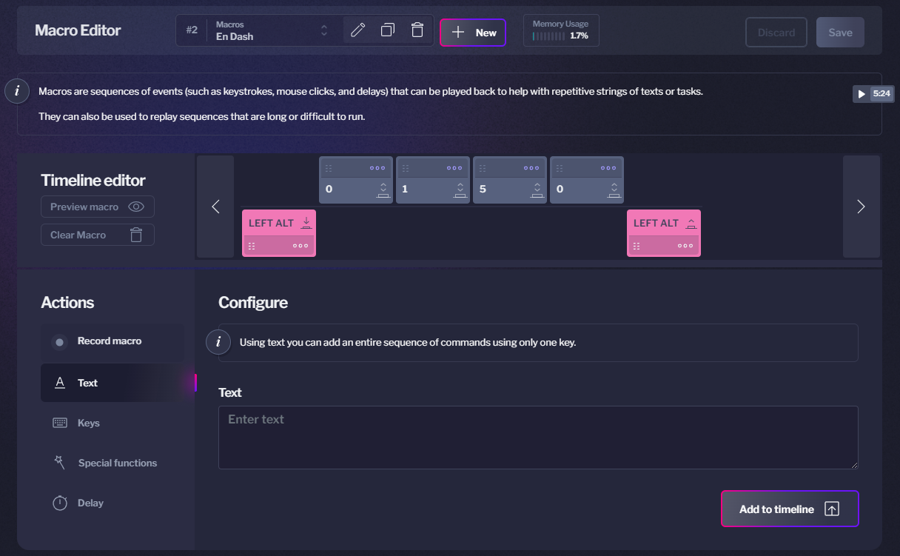

Nbsp:
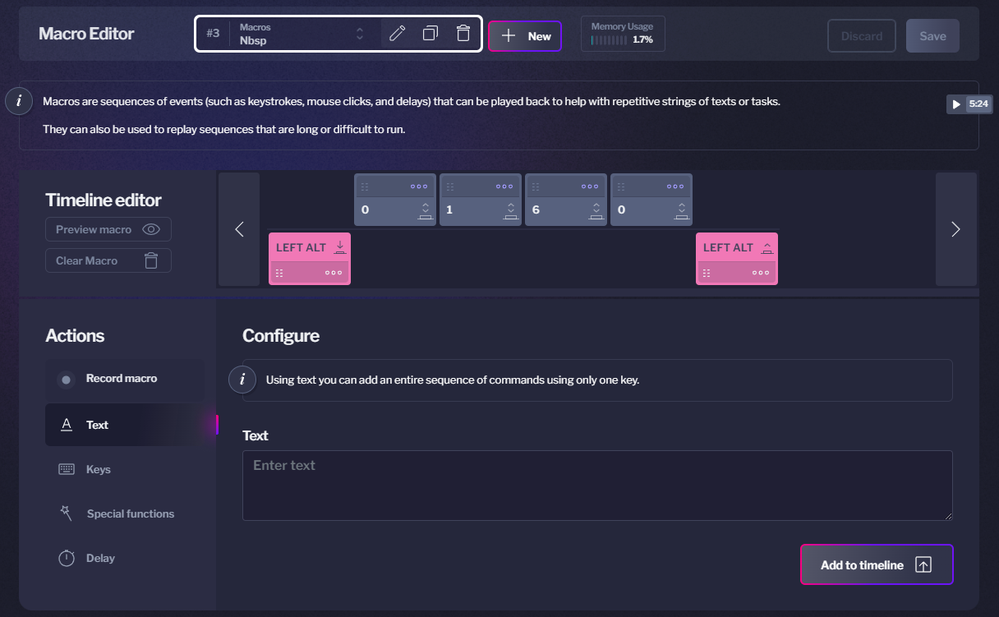

### Superkeys

Here are my superkeys:

Superkey CCP:
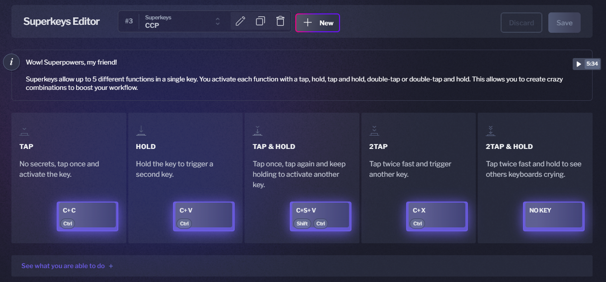

Superkey Layer:
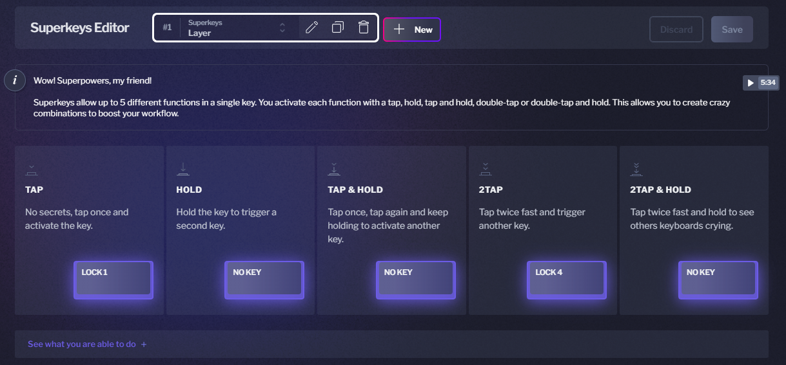

## Learning the new layout

To adapt to this new layout, I used various resources.

- [Typingclub](https://www.typingclub.com/) to learn the letter positions.
- [keybr.com](https://www.keybr.com/) to focus on getting my fingers up to spead.
- [monkeytype.com](https://monkeytype.com/) for a more realistic typing experience.
  - I use English 1k as a benchmark of my typing speed.
  - For text, I put in some chapters of [Alexander Wales' Worth the Candle](https://archiveofourown.org/works/11478249) and typed it out.
  - For programming, I use the programming language "quotes".

## Alternatives

Here are some other layouts for the Defy you might want to have a look at:

- [objectmanip's layout](https://github.com/objectmanip/Dygma-Defy-Layers): A complex Colemak-DH layout with multiple layers.
- [tarbari's layout](https://github.com/tarbari/defy_layers): Another Colemak-DH variant with unique features.
- [Obskyur's layout](https://github.com/Obskyur/Dygma-Defy__Profiles): A QWERTY layout with some interesting ideas.
- [barlevalon's layout](https://github.com/barlevalon/dotfiles/blob/main/dygma/miryoku-qwerty/README.md): A layout based on miryoku.

Many more (of various quality) can be found on the [Dygma Discord](https://www.dygma.com/discord) in the [share-your-layers channel](https://discord.com/channels/895297925578637362/1143898136427909323).
